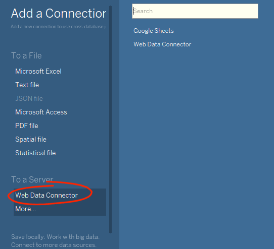
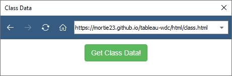
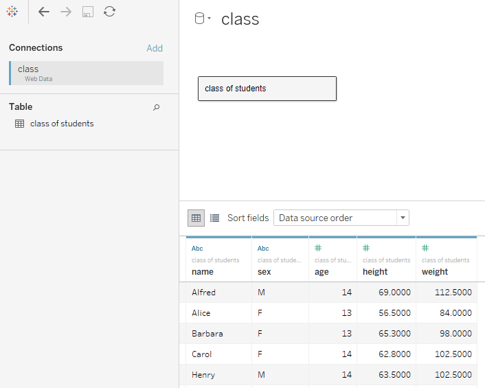

# Tableau WDC

Quick example of a Tableau Web Data Connector (WDC) pointing to the output of a SAS proc json.  
Reason: For example, your source data is in SAS, and your BI tool is Tableau. 
You want a way to publish data to Tableau and have access to a webserver.

## Tutorial

This is based on this tutorial.  
[https://tableau.github.io/webdataconnector/docs/wdc_tutorial.html](https://tableau.github.io/webdataconnector/docs/wdc_tutorial.html)

## Generate the data

To generate the JSON I installed WPS Community edition.  

```sas
libname this "./data";
proc json out="./json/class.json";
  export this.class;
run;
```

## Deploy the HTML/JS/JSON

Copy the files to a location on your webserver. In this example I'll be using my [mortie23.github.io/](https://mortie23.github.io/)

## Test the WDC

Open up Tableau (in this case I'm just using Tableau Public Desktop).  

### Add a data connection  



### Browse the the published WDC HTML page



### Get the data

Click `Get Class Data!` and you should be able to build a dashboard from the JSON data now.  

